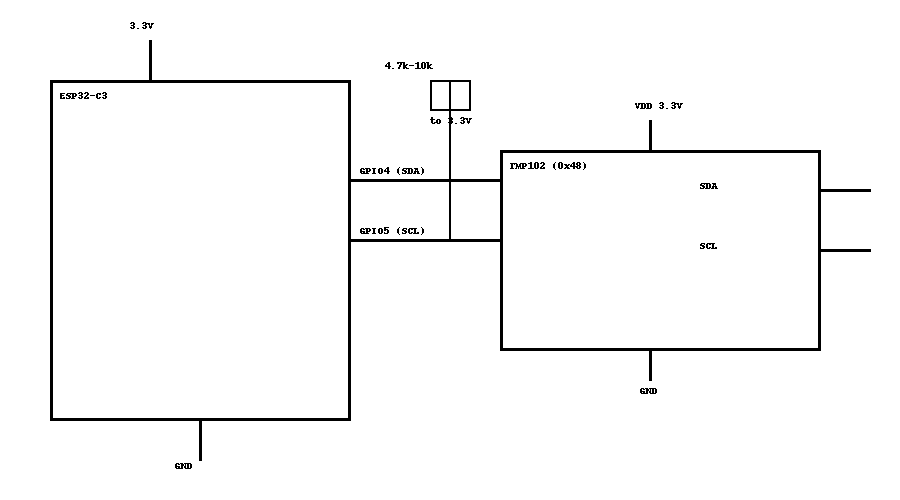

# Lindas Gröna Sköna – Del 2 (VG): TMP102-drivrutin för ESP32-C3 via I²C

**Väl godkänt – Drivrutin för TMP102 på ESP32-C3 via I²C**  
Del 2 av kursen *Inbyggda system och arkitektur*, projekt **Lindas Gröna Sköna**.  
Implementerar en modulär temperatursensordrivrutin i C med abstrakt gränssnitt (`temp_driver.h`) och UART-loggning.

## Funktioner
- ESP-IDF-projekt för **ESP32-C3**.
- I²C Master, läser TMP102 @ `0x48` (register `0x00`) med repeated start.
- Konverterar **12-bit two's complement** till Celsius (0.0625°C/LSB).
- Felhantering: timeout, NACK, okänt fel.
- Appen loggar temperatur var **5:e sekund**.

## Hårdvara / koppling
- **VDD** 3.3V, **GND** GND
- **SDA** -> GPIO4 (med pull-up 4.7k–10k till 3.3V)
- **SCL** -> GPIO5 (med pull-up 4.7k–10k till 3.3V)
- I²C-adress: `0x48` (standard för TMP102-moduler)



> Behöver du andra pinnar? Ändra `I2C_SDA_GPIO` och `I2C_SCL_GPIO` i `main/tmp102.c`.

## Bygga & köra (ESP-IDF 5.x)
```bash
idf.py set-target esp32c3
idf.py build
idf.py -p /dev/ttyUSB0 flash monitor
```
> Justera portflaggan `-p` efter din miljö.

## Projektstruktur
```
.
├─ CMakeLists.txt
├─ assets/
│  └─ wiring.png
├─ index.html
└─ main/
   ├─ CMakeLists.txt
   ├─ main.c
   ├─ temp_driver.h
   └─ tmp102.c
```

## Exempeloutput
```
TMP102 demo startar...
TMP102 init OK.
Temp: raw=328, 20.50 C
Temp: raw=329, 20.56 C
...
```

## Licens
MIT
